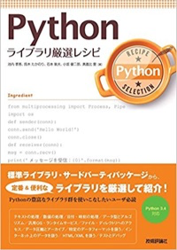
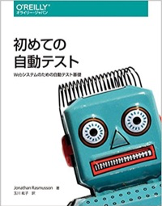
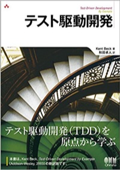
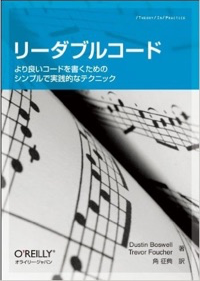

# はじめに

誤解されないように言っておきたいことがあります。せっかく来てくれたのにゴメンナサイ。

### 私、そんなにテスト詳しくないです！

仕事で普通に書くくらい。レビューに出したらいろいろ指摘を受けます。

このイベントのオファーが来たので、渡りに船！と思い勉強しました。
私も目的がないと何もしない人なので、勉強の理由をいつも探しています。
良い機会をいただけて、PyLadiesに感謝しています。

皆様も次のイベントで興味がある事の講師をやってみてはどうでしょうか。圧倒的に成長できます。

尊敬する[tokibitoさん](https://twitter.com/tokibito)が言いました。 **「勉強すればできる」** と。

今日、解決しなかったら、一緒に勉強していきましょう！

## 勉強した本

普通の入門書では余りテストについて触れていないです。以下の本は参考になりました。

今日の話は以下の本を読めば、カバーできます。

[Pythonライブラリ厳選レシピ](https://www.amazon.co.jp/dp/4774177075/)
11章

[初めての自動テスト ―Webシステムのための自動テスト基礎](https://www.amazon.co.jp/dp/4873118166/)
6章

[テスト駆動開発](https://www.amazon.co.jp/dp/4274217884/)

[リーダブルコード](https://www.amazon.co.jp/dp/4873115655/)
13章

## 参考にしたブログ

- [[Python] 初中級者のためのpytest入門 - くろのて](http://note.crohaco.net/2016/python-pytest/)
- [[python] まだmockで消耗してるの？mockを理解するための3つのポイント - くろのて](http://note.crohaco.net/2015/python-mock/)

## 勉強しながら書いたブログ

勉強したら忘れちゃうので記録に残しましょう。

- [Pythonでテストしたい](http://kamekokamekame.net/advent_calendar/2017/12/18/article.html)
- [doctestを触ってみた](http://kamekokamekame.net/python/2017/12/10/article.html)
- [unittestの公式ドキュメントを読んでみた](http://kamekokamekame.net/python/2017/12/11/article.html)
- [unittestのテスト前後に実行される処理の確認](http://kamekokamekame.net/python/2017/12/12/article.html)
- [unittest.mock.MagicMockを使ってみる](http://kamekokamekame.net/python/2017/12/16/article.html)
- [unittest.mock.patchを使ってみる（デコレータ）](http://kamekokamekame.net/python/2017/12/17/article.html)
- [unittest.mock.patchを使ってみる（コンテキストマネージャ）](http://kamekokamekame.net/python/2017/12/19/article.html)
- [pytestを使ってみる](http://kamekokamekame.net/python/2017/12/21/article.html)
