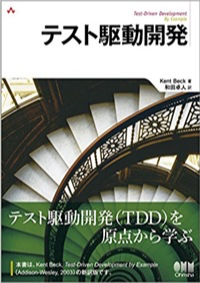

# テスト駆動開発

[テスト駆動開発](https://www.amazon.co.jp/dp/4274217884/)

この本のサンプルの殆どがJavaで書かれていたので、Pythonで書き直してみました。
[books_code_of_python/test_driven_development](https://github.com/okusama27/books_code_of_python/tree/master/test_driven_development)

## メリット

- 必要なものだけ実装できる
- テストしやすく部品化された状態でシステムを設計、実装できる
- 実装が完了すると同時に、その動作を保証するユイットテストも出来上がっている

## やり方

- TODOリストにやるべきことを書く
- 最初にテストを書く
- 最初にアサーションを書く
- 失敗する
- テストが成功するように実装する
- リファクタリングする

## 不具合が起きた時

- 不具合を再現するテストを書く
- 実行して、失敗する
- 不具合を修正する

これを踏まえてやってみましょう。

## FizzBuzz

FizzBuzzプログラムとテストを書きます。

FizzBuzzに関してはwikipediaを参照ください。 [Fizz Buzz - Wikipedia](https://ja.wikipedia.org/wiki/Fizz_Buzz)

### 仕様を考える
まずは、Fizz Buzzの仕様を考えます。

数を与えると、その数に応じて戻り値が異なる

- [ ] 数字を文字列で返す
ただし、
- [ ] 3で割り切れる数の場合は「Fizz」と返す
- [ ] 5で割り切れる数の場合は「Buzz」と返す
- [ ] 3と5で割り切れる数の場合は「FizzBuzz」と返す

## テストを書きながら、実装しましょう

1. テストを1つ書く

  - [ ] 数字を文字列で返す

2. すべてのテストを走らせ、新しいテストの失敗を確認する
3. 小さな変更を行う
4. すべてのテストを走らせ、すべて成功することを確認する
5. 1に戻って、1つのテストを書いて、成功するように実装をする。

  - [ ] 3で割り切れる数の場合は「Fizz」と返す
  - [ ] 5で割り切れる数の場合は「Buzz」と返す
  - [ ] 3と5で割り切れる数の場合は「FizzBuzz」と返す

6. リファクタリングを行って重複を除去する
