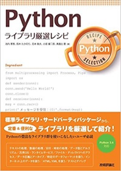

# はじめに

誤解されないように言っておきたいことがあります。

**私、そんなにテスト詳しくないです。**

仕事で普通に書くくらい。

このイベントのオファーが来たので、渡りに船！と思い勉強しました。私も目的がないと何もしない人なので、勉強の理由をいつも探しています。良い機会をいただけて、PyLadiesに感謝しています。

皆様も次のイベントで興味がある事の講師をやってはどうでしょうか。圧倒的に成長できます。

尊敬するtokibitoさんが言いました。 **「勉強すればできる」** と。

今日、解決しなかった疑問も一緒に勉強していきましょう！

## 勉強した本

[Pythonライブラリ厳選レシピ](https://www.amazon.co.jp/dp/4774177075/)

[初めての自動テスト ―Webシステムのための自動テスト基礎](https://www.amazon.co.jp/dp/4873118166/)

[テスト駆動開発](https://www.amazon.co.jp/dp/4274217884/)

## 参考にしているブログ

- [[Python] 初中級者のためのpytest入門 - くろのて](http://note.crohaco.net/2016/python-pytest/)
- [[python] まだmockで消耗してるの？mockを理解するための3つのポイント - くろのて](http://note.crohaco.net/2015/python-mock/)

## 勉強したときに書いたブログ

- [Pythonでテストしたい](http://kamekokamekame.net/advent_calendar/2017/12/18/article.html)
- [doctestを触ってみた](http://kamekokamekame.net/python/2017/12/10/article.html)
- [unittestの公式ドキュメントを読んでみた](http://kamekokamekame.net/python/2017/12/11/article.html)
- [unittestのテスト前後に実行される処理の確認](http://kamekokamekame.net/python/2017/12/12/article.html)
- [unittest.mock.MagicMockを使ってみる](http://kamekokamekame.net/python/2017/12/16/article.html)
- [unittest.mock.patchを使ってみる（デコレータ）](http://kamekokamekame.net/python/2017/12/17/article.html)
- [unittest.mock.patchを使ってみる（コンテキストマネージャ）](http://kamekokamekame.net/python/2017/12/19/article.html)
- [pytestを使ってみる](http://kamekokamekame.net/python/2017/12/21/article.html)

