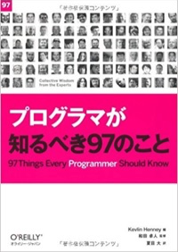
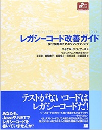

# テストとは

私がここ数年でテストに関して知ったことを紹介します。

[プログラマが知るべき97のこと](https://www.amazon.co.jp/dp/4873114799/)にあるテストに関するところが素晴らしいのでみていきましょう。

- 「面倒でも自動化できることは自動化する」  ケイ・ホルストマン（Cay Horstmann）
- 「偶然の仕様ではなく本物の仕様のためのテストを書く」  ケブリン・ヘニー（Kevlin Henney）
- 「テストのないソフトウェア開発はあり得ない」  ニール・フォード（Neal Ford）
- 「関数の「サイズ」を小さくする」  ケース・ブレイスウェイト（Keith Braithwaite）
- 「コードを見る人のためにテストを書く」  ジェラルド・メサローシュ（Gerard Meszaros）
- 「テストは正確に、具体的に」  ケブリン・ヘニー（Kevlin Henney）
- 「不具合にテストを書いて立ち向かう」  和田 卓人

レガシーコードとは「仕様がわからないコード」「理解しづらいコード」「変更しにくいコード」のことを指していました。
しかし、[レガシーコード改善ガイド](https://www.amazon.co.jp/dp/4798116831/)の登場で意味が狭くなりました。

**テストが無いプログラムコード** を **レガシーコード** と呼ぶようになりました。

テストを書かないプログラムを書くプログラマーはレガシープログラマーと呼ばれます。（たぶん）

プログラムを書くときはテストも一緒に書きましょう。

- テストはそのプログラムの仕様を説明します。
- プログラマが正しいと考えている仕様はテストに全部反映されています。
- テストが書きやすいプログラムを書くようにしましょう。

テストは、そのモジュールの使い方のサンプルにもなっています。
